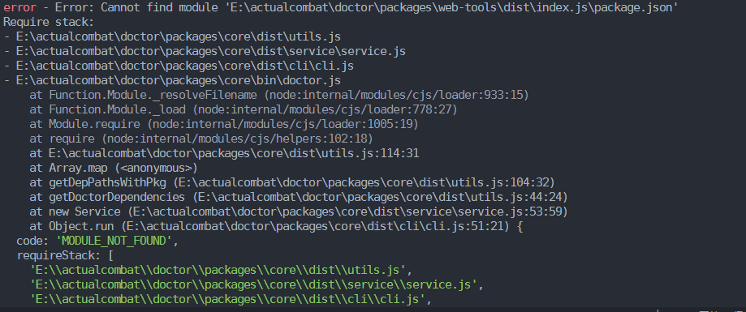
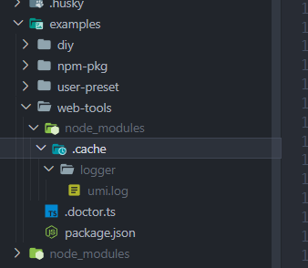
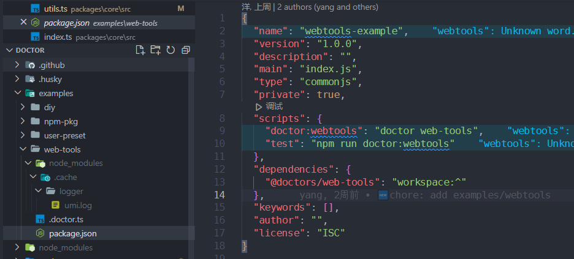
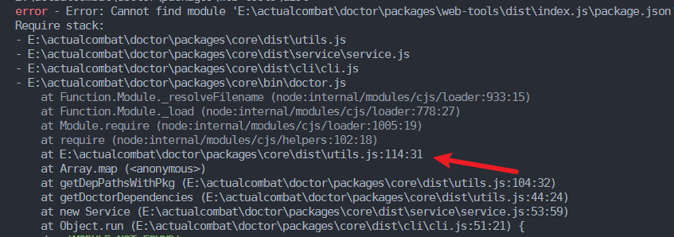

## 问题描述

在使用pnpm v8.0.0安装项目依赖以后进入`example/web-tools`目录`npm run test`报错



## 问题排查

根据报错我们可以排查到在`example/web-tools`中的node_modules中并没有正确安装到 **@doctors/web-tools** 这个依赖



尽管在package.json中的dependencies中有这个依赖



但是在项目根目录中有 **@doctors/web-tools** 这个依赖

初步怀疑是pnpm的版本问题，但是因为要保证用户以及开发者的兼容性，最好对这种情况做出兼容。

## 源码调试

在洋佬的带领下直接进行一个源码的调试。从调用栈中可以看出报错出现在114行



然后我们点击进入114行所在的函数

```typescript
function getDepPathsWithPkg(rootPath: string) {
  const pkgPath = path.join(rootPath, "package.json");
  let packageJson;
  if (fs.existsSync(pkgPath)) {
    packageJson = require(pkgPath);
  } else {
    return [];
  }
  const dependencyNames = Object.keys(packageJson?.dependencies || []);
  const doctorDependencyNames = dependencyNames.filter(
    (name) =>
      validPresetNamePrefix.some((i) => name.startsWith(i)) &&
      !notValidPackages.includes(name)
  );
  return doctorDependencyNames.map((name) => {
    const modulePath = path.join(rootPath, "node_modules", name);
    const modulePackageJson = require(path.join(modulePath, "package.json"));
    const hasCommand = fs.existsSync(path.join(modulePath, "./dist/commands"));
    return {
      name,
      version: modulePackageJson.version,
      path: modulePath,
      hasCommand,
    };
  }) as PluginMeta[];
}

```

该函数的主要目的是读取package.json的`@doctor/**`的依赖，并且获得其路径。但是是从rootPath也就是`examples/web-tools`中的node_module中读取，但是在遇到以上情况时自然是读取不到的。

```typescript
function getDepPathsWithPkg(rootPath: string,isLocal: boolean = true) {
  const pkgPath = path.join(rootPath, "package.json");
  let packageJson;
  if (fs.existsSync(pkgPath)) {
    packageJson = require(pkgPath);
  } else {
    return [];
  }
  const dependencyNames = Object.keys(packageJson?.dependencies || []);
  const doctorDependencyNames = dependencyNames.filter(
    (name) =>
      validPresetNamePrefix.some((i) => name.startsWith(i)) &&
      !notValidPackages.includes(name)
  );
  return doctorDependencyNames.map((name) => {
    let  modulePath: string
    if(isLocal){
      modulePath = require.resolve(name);
    }else{
      modulePath = path.join(rootPath, "node_modules", name);
    }
    modulePath =  modulePath.substring(0,modulePath.length-14);
    
    const modulePackageJson = require(path.join(modulePath, "package.json"));
    const hasCommand = fs.existsSync(path.join(modulePath, "./dist/commands"));
    return {
      name,
      version: modulePackageJson.version,
      path: modulePath,
      hasCommand,
    };
  }) as PluginMeta[];
}
```

在改动后的代码中增加isLocal判断是否是在`example/web-tools`执行的命令，如果是的话isLocal则会为true，则会找到项目根目录下的依赖并且获得其路径，最后再使用substring截取掉入口文件，就获得了依赖所在的目录。

