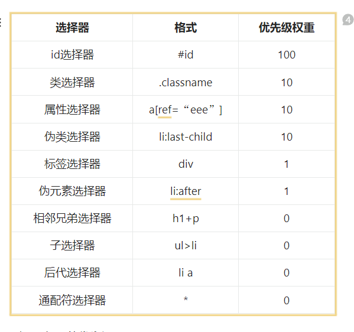

## 1.css选择器以及优先级



标签选择器、伪元素选择器：1；类选择器、伪类选择器、属性选择器：10；id 选择器：100；内联样式：1000；

## 2. display的block、inline和inline-block的区别

（1）block：会独占一行，多个元素会另起一行，可以设置width、height、margin和padding属性；
（2）inline：元素不会独占一行，**设置width、height属性无效**。但**可以设置水平方向的margin和padding属性**，`不能设置垂直方向的padding和margin`；
（3）inline-block：将对象设置为inline对象，但对象的内容作为block对象呈现，之后的内联对象会被排列在同一行内。
对于行内元素和块级元素，其特点如下：
	（1）行内元素
		设置宽高无效；
		可以设置水平方向的margin和padding属性，不能设置垂直方向的padding和margin；
		不会自动换行；
	（2）块级元素
		可以设置宽高；
		设置margin和padding都有效；
		可以自动换行；
		多个块状，默认排列从上到下。

## 3.隐藏元素的方法有哪些

display: none：渲染树不会包含该渲染对象，因此该元素不会在页面中占据位置，也不会响应绑定的监听事件。
visibility: hidden：元素在页面中仍占据空间，但是不会响应绑定的监听事件。
opacity: 0：将元素的透明度设置为 0，以此来实现元素的隐藏。元素在页面中仍然占据空间，并且能够响应元素绑定的监听事件。
position: absolute：通过使用绝对定位将元素移除可视区域内，以此来实现元素的隐藏。
z-index: 负值：来使其他元素遮盖住该元素，以此来实现隐藏。
clip/clip-path ：使用元素裁剪的方法来实现元素的隐藏，这种方法下，元素仍在页面中占据位置，但是不会响应绑定的监听事件。
transform: scale(0,0)：将元素缩放为 0，来实现元素的隐藏。这种方法下，元素仍在页面中占据位置，但是不会响应绑定的监听事件。

## 4.display:none与visibility:hidden的区别

这两个属性都是让元素隐藏，不可见。两者区别如下：
（1）在渲染树中
display:none会让元素完全从渲染树中消失，渲染时不会占据任何空间；
visibility:hidden不会让元素从渲染树中消失，渲染的元素还会占据相应的空间，只是内容不可见。
（2）是否是继承属性
**display:none是非继承属性**，子孙节点会随着父节点从渲染树消失，通过修改子孙节点的属性也无法显示；
**visibility:hidden是继承属性**，子孙节点消失是由于继承了hidden，通过设置visibility:visible可以让子孙节点显示；
（3）修改常规文档流中元素的**display 通常会造成文档的重排**，但是**修改visibility属性只会造成本元素的重绘**；
（4）如果使用读屏器，设置为display:none的内容不会被读取，设置为visibility:hidden的内容会被读取。

## 5.css 如何实现左侧固定 300px，右侧自适应的布局

(1) 左侧 300px；右侧 flex: 1; 采用 flex 的固比模型

(2) 使用 calc 方法 .left{width:300px;} .right{width: calc(100% - 300px)}

## 6.[怎么触发BFC，BFC有什么用](https://q.shanyue.tech/fe/css/572.html#%E4%BD%BF%E7%94%A8-flex)

触发

1. 根元素或包含根元素的元素
2. 浮动元素 float ＝ left | right 或 inherit**（≠ none）**
3. 绝对定位元素 position ＝ absolute 或 fixed
4. display ＝ inline-block | flex | inline-flex | table-cell 或 table-caption
5. overflow ＝ hidden | auto 或 scroll **(≠ visible)**

作用

1.包含浮动元素（清除浮动）

2.导致外边距折叠

## 7.怪异盒模型，标准盒模型

怪异: content+padding+border

标准: content+padding+border+margin

## 8.flex 布局

flex-shrink 等比例缩小 flex-grow 等比例放大 flex-basis 盒子宽度，如果设置了width，则以flex-basis

flex1：实际上是flex-grow、flex-shrink和flex-basis三个属性的缩写。

flex:1 ==> flex:1 1 0% 

## 9.如何实现水平垂直居中

1. flex: flex + just:center + align center

2. 定位: 

   ```html
   .box {
     postion: absolute;
     top: 50%;
     bottom: 50%;
     width: 50px;
     height: 50px;
     transform: translate(-50%, -50%);
   }
   <body>
   <div class="box"><div>
   </body>
   ```

3. flex+margin

	```css
	.box {
	  display: flex;
	}
	
	.item {
	  margin: auto;
	}
	```

## 10.em和rem的区别

​	em使用的是当前块的font-size，rem使用html根的font-size
