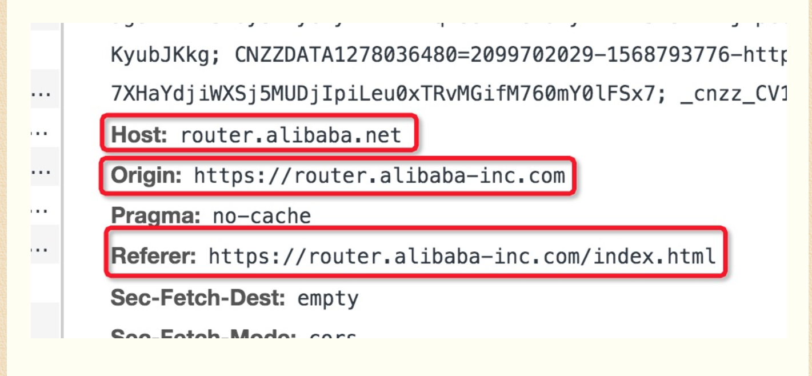

## 1.数组的some和every方法

some 有一个符合就为true

every 需要全部符合

## 2.promise常用的类方法

**Promise.all** 全为Fulfilled 才为fulfilled，如果有一个rejected

则状态变为rejected

**Promise.race** 先执行到成功就返回成功的状态，返回失败就是失败状态

**Promise.allSettled**：

```js
[
  { status: 'fulfilled', value: 11111 },
  { status: 'rejected', reason: 22222 },
  { status: 'fulfilled', value: 33333 }
]
```

**Promise.any** 只要有一个resolve，则返回最快resolve的值， 

如果都reject了，则返回一个reject数组

1. 判断 null undefined typeof ! object return null

2. map 有就返回
3. 没有就创建一个放进map
4. 那对象键和symbol的键
5. for循环递归


1. nexttick 原理
2. 强缓存协商缓存

## 跨标签通信
1. onstorage
2. new BroadcastChannel('xxx')

## referer origin host
1、Host
表示当前请求要被发送的目的地，说白了就是当前请求目标资源的host，仅包括域名和端口号，如test.haoji.me。在任何类型请求中，request都会包含此header信息。
2、Origin
表示当前请求资源所在页面的协议和域名，如http://blog.haoji.me，特别注意：
这个参数一般只存在于CORS跨域请求中，普通请求没有这个header！
3、Referer
表示当前请求资源所在页面的完整路径：协议+域名+查询参数（注意不包含锚点信息），如http://blog.haoji.me/http-host-origin-referer.html?a=1&b=2，所有类型的请求都包含此header。

