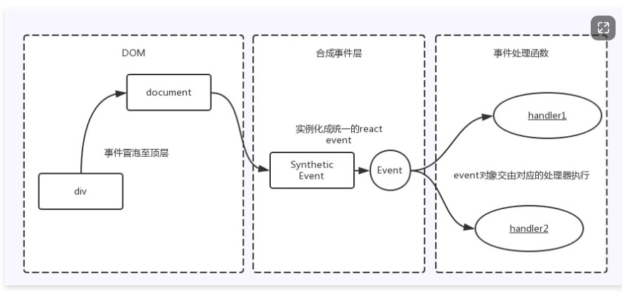
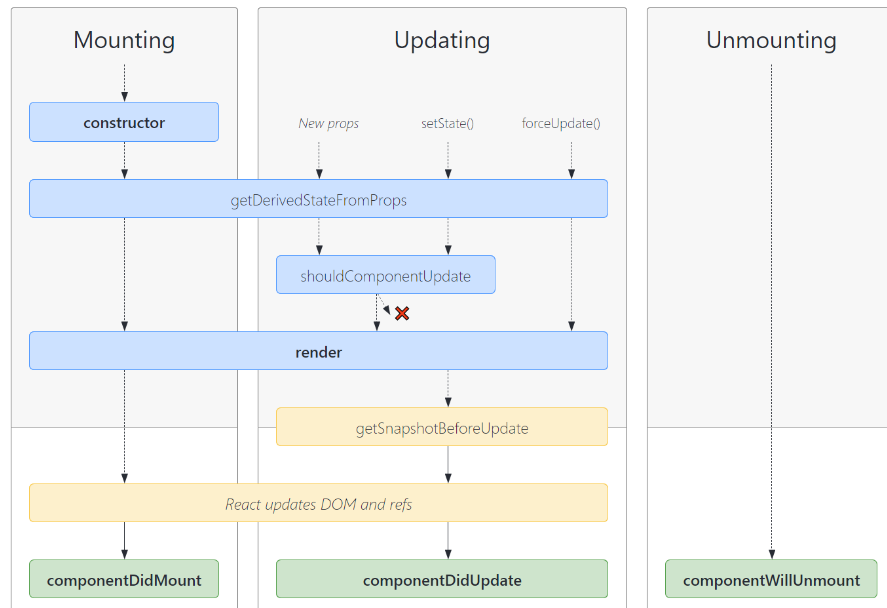

## 1.类组件

```js
class App extends React.Component {
  constructor(props) {
    super(props)
    this.state = {
      message: "Hello React Scaffold"
    }
  }

  render() {
    const { message } = this.state

    return (
      <div>
        <h2>{message}</h2>
        <HelloWorld/>
      </div>
    )
  }
}

export default App
```


## 2.一个Redux应该包含的文件

一个redux应该包含四个文件

```js
//actionCreator.js
import * as actionTypes from "./constants"

export const addNumberAction = (num) => ({
  type: actionTypes.ADD_NUMBER,
  num
})

export const subNumberAction = (num) => ({
  type: actionTypes.SUB_NUMBER,
  num
})

//constants
export const ADD_NUMBER = "add_number"
export const SUB_NUMBER = "sub_number"

// reducer
import * as actionTypes from "./constants"

const initialState = {
  counter: 100,

}

function reducer(state = initialState, action) {
  switch (action.type) {
    case actionTypes.ADD_NUMBER:
      return { ...state, counter: state.counter + action.num }
    case actionTypes.SUB_NUMBER:
      return { ...state, counter: state.counter - action.num }

    default:
      return state
  }
}

export default reducer
// index
import reducer from "./reducer";
export default reducer
export * from "./actionCreator"
```

## 3. 如何在组件中使用redux

### 类组件

```js
class ComponentsClass extends Component {
    constructor(props) {
    	super(props);
    }
  render(){
    const { counter } = this.props;
    return <>{counter}</>
  }
}
export default connect(
  (store) => ({ counter: store.counter.counter }),
  (dispatch) => ({ dispatch })
)(ComponentsClass);
```

### 函数组件

```js
  const { counter } = useSelector((state) => ({
    counter: state.counter.counter,
  }));
	const dispatch = useDispatch()
```

## 4. useRef消除闭包陷阱

```js
  const [count, setCount] = useState(0)
  // 会产生闭包陷阱，拿到的count永远都是0
	const increment = useCallback(() => {
    setCount(count)
  }, [])
  //  ref永远都是一个引用
  const countRef = useRef()
  countRef.current = count
	const increment = useCallback(() => {
    setCount(countRef.current)
  }, [])
```

## 5.useTransition

返回两个值，第一个是现在是否是pending，第二个是一个函数，传入一个回调函数可以将它放入低优先级调度，

```jsx
import React, { memo, useState, useTransition } from 'react'
import namesArray from './namesArray'

const App = memo(() => {
  const [showNames, setShowNames] = useState(namesArray)
  const [ pending, startTransition ] = useTransition()

  function valueChangeHandle(event) {
    startTransition(() => {
      const keyword = event.target.value
      const filterShowNames = namesArray.filter(item => item.includes(keyword))
      setShowNames(filterShowNames)
    })
  }

  return (
    <div>
      <input type="text" onInput={valueChangeHandle}/>
      <h2>用户名列表: {pending && <span>data loading</span>} </h2>
      <ul>
        {
          showNames.map((item, index) => {
            return <li key={index}>{item}</li>
          })
        }
      </ul>
    </div>
  )
})

export default App

```

## 6.useDeferrdValue

useDeferredValue传入一个state，react可以把他设置为低优先级调度

```jsx
import React, { memo, useState, useDeferredValue } from 'react'
import namesArray from './namesArray'

const App = memo(() => {
  const [showNames, setShowNames] = useState(namesArray)
  const deferedShowNames = useDeferredValue(showNames)

  function valueChangeHandle(event) {
    const keyword = event.target.value
    const filterShowNames = namesArray.filter(item => item.includes(keyword))
    setShowNames(filterShowNames)
  }

  return (
    <div>
      <input type="text" onInput={valueChangeHandle}/>
      <h2>用户名列表: </h2>
      <ul>
        {
          deferedShowNames.map((item, index) => {
            return <li key={index}>{item}</li>
          })
        }
      </ul>
    </div>
  )
})

export default App

```

## 7.useReducer

```jsx
import React, { memo, useReducer } from 'react'

function reducer(state, action) {
  switch(action.type) {
    case "increment":
      return { ...state, counter: state.counter + 1 }
    case "decrement":
      return { ...state, counter: state.counter - 1 }
    case "add_number":
      return { ...state, counter: state.counter + action.num }
    case "sub_number":
      return { ...state, counter: state.counter - action.num }
    default:
      return state
  }
}


const App = memo(() => {
  const [state, dispatch] = useReducer(reducer, { counter: 0, friends: [], user: {} })


  return (
    <div>
      <h2>当前计数: {state.counter}</h2>
      <button onClick={e => dispatch({type: "increment"})}>+1</button>
      <button onClick={e => dispatch({type: "decrement"})}>-1</button>
      <button onClick={e => dispatch({type: "add_number", num: 5})}>+5</button>
      <button onClick={e => dispatch({type: "sub_number", num: 5})}>-5</button>
      <button onClick={e => dispatch({type: "add_number", num: 100})}>+100</button>
    </div>
  )
})

export default App
```

## 8.React为什么使用合成事件

React并不是将click事件绑定到了div的真实DOM上，而是在document处监听了所有的事件，当事件发生并且冒泡到document处的时候，React将事件内容封装并交由真正的处理函数运行。这样的方式不仅仅减少了内存的消耗，还能在组件挂在销毁时统一订阅和移除事件。



## 9.对于react fiber的理解

React V15 在渲染时，会递归比对 VirtualDOM 树，找出需要变动的节点，然后同步更新它们， 一气呵成。这个过程期间， React 会占据浏览器资源，这会导致用户触发的事件得不到响应，并且会导致掉帧，导致用户感觉到卡顿。

为了**给用户制造一种应用很快的“假象”**，不能让**一个任务长期霸占着资源**。 可以将浏览器的渲染、布局、绘制、资源加载(例如 HTML 解析)、事件响应、脚本执行视作操作系统的“进程”，需要通过某些调度策略合理地分配 CPU 资源，从而提高浏览器的用户响应速率, 同时兼顾任务执行效率。
所以 React 通过Fiber 架构，让这个执行过程变成**可被中断**。“适时”地让出 CPU 执行权，除了可以让浏览器及时地响应用户的交互，还有其他好处:
分批延时对DOM进行操作，避免一次性操作大量 DOM 节点，可以得到更好的用户体验；
给浏览器一点喘息的机会，它会对代码进行编译优化（JIT）及进行热代码优化，或者对 reflow 进行修正。

## 10.redux-thunk的使用

```js
//actionCreators.js
export const fetchHomeMultidataAction = () => {
  // 如果是一个普通的action, 那么我们这里需要返回action对象
  // 问题: 对象中是不能直接拿到从服务器请求的异步数据的
  // return {}

  return function(dispatch, getState) {
    // 异步操作: 网络请求
    // console.log("foo function execution-----", getState().counter)
    axios.get("http://123.207.32.32:8000/home/multidata").then(res => {
      const banners = res.data.data.banner.list
      const recommends = res.data.data.recommend.list

      // dispatch({ type: actionTypes.CHANGE_BANNERS, banners })
      // dispatch({ type: actionTypes.CHANGE_RECOMMENDS, recommends })
      dispatch(changeBannersAction(banners))
      dispatch(changeRecommendsAction(recommends))
    })
  }

  // 如果返回的是一个函数, 那么redux是不支持的
  // return foo
}

```

```js
import { createStore, applyMiddleware, compose } from "redux"
import thunk from "redux-thunk"
import reducer from "./reducer"

// 正常情况下 store.dispatch(object)
// 想要派发函数 store.dispatch(function)

// redux-devtools
const composeEnhancers = window.__REDUX_DEVTOOLS_EXTENSION_COMPOSE__({trace: true}) || compose;
const store = createStore(reducer, composeEnhancers(applyMiddleware(thunk)))

export default store

```

## 11.react生命周期

