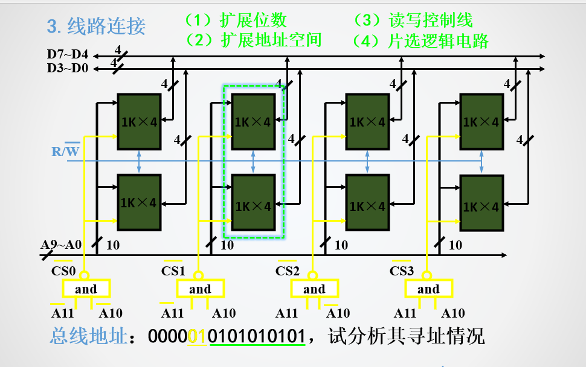

##  5课本

#### p4 计算机系统，冯洛伊曼，体系结构

- 运算器、存储器、控制器、输入设备、输出设备
- 软件以二进制表示
- 采用存储程序
- - 所有程序预先存放在存储器中
  - 指令采用串行执行方式

#### ppt4 p126-124 cache 寻址

直接映射 区地址，行索引，块内偏移

#### IEEE

#### 溢出

- 正数加正数等于负数
- 最高位和次高位进位不同
- 11+11 加出来等于11 00 没溢出 01 10 溢出

#### 存储系统的层次结构，三级存储的特点，为什么要那么做，它的好处，目的

存储系统的层次结构通常包括主存储器（内存）、辅助存储器（硬盘、SSD等）和远程存储器（网络存储等）。其中，主存储器的访问速度最快、容量最小，而辅助存储器的容量较大、速度较慢，而远程存储器则距离最远、速度最慢。

三级存储通常是指将存储系统划分为三个层次：高速缓存、主存储器和辅助存储器。高速缓存位于CPU内部，容量较小但速度非常快，主要用于缓存CPU频繁使用的数据和指令。主存储器容量较大，速度+9较高，但相对于高速缓存来说仍然较慢。辅助存储器容量更大，但速度更慢，通常用于长期存储数据和程序代码。

这种分层结构的设计是为了充分利用不同存储介质的优点，同时平衡存储容量和访问速度之间的矛盾。通过将数据和指令分层存储，可以提高计算机系统的整体性能和效率。

三级存储的好处主要包括：

1. 提高计算机系统的整体性能和效率。
2. 有效地平衡存储容量和访问速度之间的矛盾。
3. 提高系统的可靠性和稳定性，避免数据丢失的风险。

三级存储的目的是为了提高计算机系统的整体性能和效率，同时平衡存储容量和访问速度之间的矛盾。通过将数据和指令分层存储，可以充分利用不同存储介质的优点，提高计算机系统的整体性能和效率。

#### 动态存储器为什么刷新？怎样刷新

动态存储器需要刷新是因为存储单元内的电荷会随着时间的推移逐渐泄漏，导致存储的信息逐渐丢失，这就是所谓的漏电效应。刷新的过程是将存储单元中的数据读出来，然后再重新写回去，这样可以重新积累电荷，保证存储单元中的数据不会丢失。刷新的频率通常是以毫秒为单位的时间间隔，具体的刷新频率取决于DRAM的设计和使用情况等因素。

## ppt

#### 四 50-57

#### 五 ppt 54-55 寄存器有多少个，寻址方式有多少种 

寻址方式有10种

#### 六 

##### 31 

##### 68-69

##### 34

##### 75

### 反码补码原码

正数 原码反码补码一样

负数 反码等于源码出符号位取反 补码等于取反以后+1

**源码转补码符号位不取反** 

**补码转负数的补码符号位取反**

**补码转源码符号位不去反**

1 1101

1 0010

1 0011

### 

